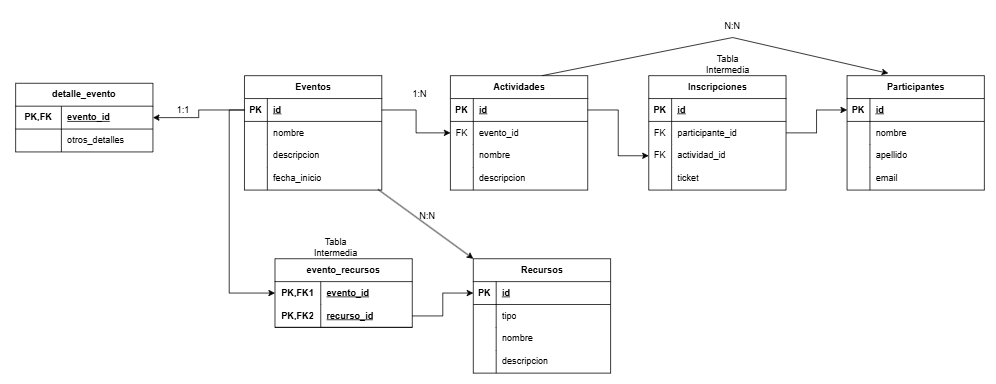

# PracticaUD3
## 1. Descripción del problema 
Una empresa especializada en la organización de eventos desea modernizar su proceso de gestión, centralizando en una única plataforma digital la administración de sus eventos, actividades, inscripciones y recursos.  
 
<strong>Esta es la solución propuesta:</strong>  

La primera solución es implementar un <strong>CRUD</strong>. La aplicación deberá permitir la creación, edición y eliminación de eventos, cada uno de los cuales podrá incluir múltiples actividades o conferencias con horarios y ubicaciones específicas. Además, se gestionarán las inscripciones de los participantes, quienes podrán reservar plazas en distintas actividades mediante un sistema de tickets electrónicos. Cada evento estará asociado a diversos recursos (salas, equipos técnicos, personal) que deberán asignarse de forma óptima. 

También se implementarán estas <strong>relaciones entre tablas:</strong> relaciones de tipo 1..N entre eventos y actividades, así como relaciones N..N entre participantes y actividades a través de una tabla intermedia que registre la reserva de tickets y la asistencia. También se implementará una relación 1..1 para la gestión correcta de los detalles de los eventos. Asimismo, se incluirá la funcionalidad para generar reportes estadísticos y análisis de tendencias, lo cual facilitará la planificación y mejora continua de futuros eventos.  

Otra solución es la <strong>implementación de una API REST</strong> esto permitirá facilitar la gestión y el acceso a los datos desde distintas aplicaciones o clientes. Centralizar y organizar su información. Reducir errores y datos duplicados. Facilitar la consulta y actualización de la información. Contar con datos confiables para la toma de decisiones.  

La solución se desarrollará en Laravel, asegurando una implementación robusta y escalable.  

## 2. Modelo E-R

